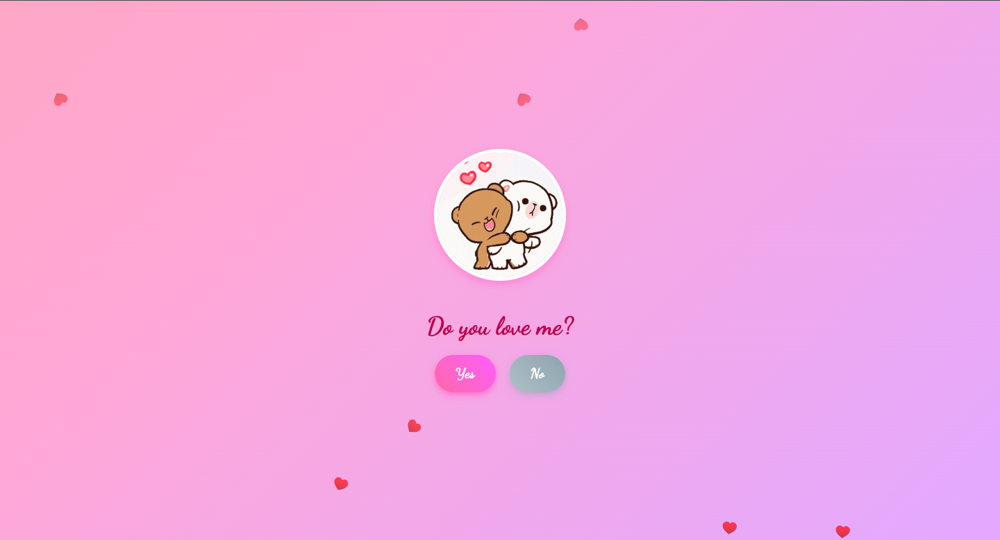

# Do You Love Me? - A Romantic Web App

A playful and romantic web application that asks, "Do You Love Me?" with a fun twist: the "No" button moves away when hovered or tapped, encouraging the user to click "Yes." Upon clicking "Yes," a second page appears with a heartfelt message, a customizable image, and vibrant animations like confetti, hearts, and sparkles. Designed with a girly aesthetic featuring pastel colors and a cursive font, this app is perfect for a lighthearted romantic gesture.

## Features

- **Interactive Buttons**: The "No" button dodges mouse or touch input, making "Yes" the only clickable option.
- **Girly Aesthetic**: Pastel pink and lavender gradients, sparkles, and the "Dancing Script" font create a romantic vibe.
- **Second Page**: Displays a loving message and a customizable image after clicking "Yes."
- **Animations**: Includes floating hearts, sparkly effects, and a confetti burst for a celebratory feel.
- **Responsive Design**: Works seamlessly on desktop and mobile devices.
- **Touch Support**: Optimized for touch interactions with no scrolling or zooming.

## Screenshot



## Installation

1. **Clone the Repository**:
   ```bash
   git clone https://github.com/ishara-madu/love-html.git
   ```

2. **Navigate to the Project Directory**:
   ```bash
   cd love-html
   ```

3. **Open the App**:
   - Open `index.html` in a web browser directly, or
   - Serve the files using a local server (recommended for best performance):
     ```bash
     npx http-server
     ```
     Then visit `http://localhost:8080` in your browser.

## Usage

1. Open the app in a web browser.
2. Hover or tap near the "No" button to see it playfully move away.
3. Click or tap the "Yes" button to transition to the second page, revealing a romantic message, a customizable image, and celebratory animations.
4. Customize the app (see below) to add your own image or modify styles.

## Customization

### Adding Your Own Image
On the second page, you can add a custom image (e.g., a photo of you and your loved one). Update the `` tag in the `.second-image-container` section of `index.html`:

```html
<div class="second-image-container">
    
</div>
```

Replace the `src` attribute with your image URL or file path:
```html

```
or, if using a local image, place it in the repository (e.g., `images/your-image.jpg`) and update to:
```html

```

### Modifying Styles
- **Colors**: Edit the `background` property in the `body` or `button` styles in `index.html` to change the pastel gradient or button colors.
- **Font**: Replace `'Dancing Script'` with another Google Font in the `<link>` tag and CSS.
- **Animations**: Adjust the `@keyframes` (e.g., `float`, `burst`, `sparkle`) to modify animation speed or effects.

### Hosting
To share the app, host it on GitHub Pages:
1. Push your repository to GitHub.
2. Enable GitHub Pages in the repository settings under the "Pages" section, selecting the `main` branch.
3. Access the app at `https://ishara-madu.github.io/love-html`.

## Technologies Used

- **HTML5**: Structure of the web app.
- **CSS3**: Styling with animations and responsive design.
- **JavaScript**: Interactivity for button movement and page transitions.
- **JSConfetti**: For confetti animations (loaded via CDN).
- **Google Fonts**: "Dancing Script" font for a romantic look.

## Contributing

Feel free to fork this repository and submit pull requests with improvements or new features! Ideas include:
- Adding sound effects for the "Yes" button click.
- Supporting multiple languages for the question and message.
- Enhancing animations with more effects.

## License

This project is licensed under the MIT License. See the [LICENSE](LICENSE) file for details.

## Acknowledgments

- Inspired by playful web apps that create fun, interactive experiences.
- Uses [JSConfetti](https://github.com/daniel-lundin/js-confetti) for confetti effects.
- Heart and sparkle icons from [Icons8](https://icons8.com).